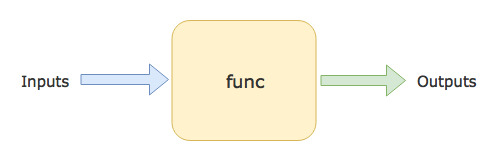

## Hàm ( Function )

- Hàm là một khái niệm để  chỉ một khối mã hay nói cách khác là một tập hợp các đoạn mã, logic cho một công 
việc xác định ( ví dụ như thực hiện một phép tính tổng , etc ). Một hàm sẽ có thể  nhận một số  dữ liệu đâu vào để  xử  lí logic và trả về  kết quả. dưới đây là hình ảnh minh hoa cụ thể:

<br>
<p align="center">
  
</p>
<br>

### Định nghĩa hàm

- Trong Go để  khai báo một hàm chúng ta sẽ sử  dụng từ khóa `func` tiếp theo đó là tên hàm cần định nghĩa và các tham số  cùng kiểu dữ liệu xác định cần đưa vào trong hàm, chúng sẽ đặt trong cặp ngoặc `()` ngay sau tên hàm và kiểu dữ liệu cân trả về  hàm, sau đó là nội dung logic cần viết trong `{}`. Nó sẽ có dạng như sau:

```go
func function_name(param type) return_type {
    // logicS
    // return value
}
```

Vd:

```go
package main

import (
    "fmt"
)

func sum(a int, b int) int {
    return a + b
}

func main() {
    fmt.Println(sum(1, 2))
    fmt.Println(sum(2, 4))
}
```

- ở đây chúng ta đinh nghĩa một hàm tính tổng nhận đầu vào là hai tham số  thuộc kiểu dữ liệu số nguyên và kết quả trả về  là kiểu dữ liệu số  nguyên, bên trong hàm này chúng ta sẽ thực hiện phép công hai tham số  đưa đã đưa vào.

- Để  gọi hàm này chúng ta sẽ gọi tên hàm mà chúng ta đã định nghĩa kèm tham số truyền vào:

```go
sum(1 ,2) \\ 3

sum(2, 4) \\ 6
```

- Tuy vậy nếu như bạn để  y hàm `main` của chúng ta nó không hề  nhận bất kỳ tham số  đâu vào nào hay trả về  kết quả nào hết. Đúng vậy lúc trước chúng ta đã nói tới hàm `main` là một hàm dặc biệt do đó có thể  nó là trường hợp duy nhất mà ko cần phải định nghĩa như sơ đồ.

- Ah thật ra không phải vậy, về  cơ bản ở sơ đồ  trên tôi đưa ra một trường hợp tổng quá của hàm thôi. Ngoài ra còn một số trường hợp khác nữa vd như giống vơi hàm `main` không cần xác định tham số  và kết quả trả về  hay một số trường hợp trả về  đa giá trị, etc.


### Hàm không cùng với tham số  và kết quả về

- Như đã đề  cập phía trên chúng ta có rất nhiều loại hàm trong đó hàm không có kết quả trả về  hay đối số  sẽ được viết dưới dạng như sau:


```go
func function_name(){
    // logicS
    // return value
}
```

Vd:

```go
package main

import (
    "fmt"
)

func hello_go() {
    fmt.Println("Hello Go!")
}

func main() {
    hello_go()
}
```

- Hãy chạy chương trình và bạn sẽ nhận được kết quả như dưới đây:

```go
Hello Go!
```

### Hàm cùng trả về  đa giá trị 

- Hầu hết các hàm mà chúng ta đã gặp hay đã làm từ trước tới giờ hay trong các ngôn ngữ khác thì chỉ trả về  duy nhất môt giá trị. Nếu muốn trả về  nhiều giá trị bạn sẽ phải bao bọc dũ liệu trong một cấu trúc hay đối tượng nào đấy ( nếu bạn không hiểu đoạn này thì không sao bởi vì ở các chương sau chúng ta sẽ học về  chúng). Tuy nhiên trong Go hỗ  trợ thêm cho chúng ta một cách nữa để  trả về  nhiều giá trị cùng lúc mà không phải dùng tới một cấu trúc nào hết.

- Bạn chỉ cần dựa theo mẫu sau:

```go
func function_name(param type) (return_type1, return_type2, ... ,return_typeN )  {
    // logicS
    // return value1, value2
}
```

Vd:

```go
package main

import (
    "fmt"
)

func people(name string, age int) (string, int) {
    return name, age
}

func main() {
    fmt.Println(people("Quan", 25))
}
```

- Thật dễ  dàng phải không, bạn chỉ cần xác định các dữ liệu cần trả về  và dặt chúng trong cặp ngoặc `()` là xong. Không có quá gì phức tạp cả và việc trả về  nhiều giá trị này còn có một ý nghĩa khá quan trọng, chỉ một chốc thôi bạn sẽ thấy.

### Hàm trả về  gía trị lỗi

- Khi xử  lí logic một hàm hay nói cách khác là khi viết một chương trình bạn chắc chắn không thể  không bắt gặp các lõi không mong muốn xảy ra, để  tránh điều này chúng ta sẽ thường sử  dụng try..catch , throw để  bắt và đưa ra các thông báo lỗi tuy vậy cách làm này thường không phải là lựa chọn hay thay vào đó chúng ta vẫn có thể  xử  lí một hàm và trả về  kết quả lỗi nếu có.

- Trong Go, chúng ta sẽ thường xuyên thấy sự kết hợp việc sử  dụng hàm đa giá trị trả về  dùng với một kêt quả lỗi:

Vd:

```go
package main

import (
	"fmt"
	"errors"
)

func divide(a float32, b float32) (error, float32) {
    if b == 0 {
        err := errors.New("Không thể  thực hiện được phép chia")
        return err, 0.0
    }
    return nil, a / b
}

func main() {
    err, result := divide(1, 0)
    if err != nil {
        fmt.Println(err)
    }
    err, result = divide(1, 1)

    fmt.Println(result)
}
```

- Thực hiện chương trình trên ta sẽ được kết quả 

```go
Không thể  thực hiện được phép chia
1
```

- Thật tuyệt vời phải không ?, bằng cách làm này chúng ta đơn giản hóa được mọi việc, chỉ cần xác định xem có lỗi hay không thông qua dư liệu trả về  thay vì phải lồng vào trong một khối xử  lí lỗi.

### Định danh trống ( Blank Identifier )

- Mặc dù với ví dụ trên chúng ta đã thấy được mặt thú ví của việc sử  dụng đa giá trị trả về  từ một hàm. Nhưng 
có một điều đáng chú ý ở đây là đôi khi một số  kết quả chúng ta chỉ quan tâm tới một giá trị thôi còn lại có thể  không sủ dụng tới. Tuy nhiên bởi vì Go làn ngôn ngữ yêu cầu chặt chẽ, do đó nó yêu cầu tất cả các biến được khai báo
đèu phải sử  dụng. Như vậy giả sử  tôi có một hàm trả về  phần tử  đầu tiên của một cặp giá trị truyền vào, và tôi chỉ cần lấy phần tử  đầu tiên ra, nhưng bởi vì hàm này sử  dụng đa giá trị truyền vào trong đó giá trị đàu tiên dùng để  biết được lỗi của chương trình. Tuy vậy với một hàm chỉ đơn giản là trả về  giá trị sẽ không có lỗi. vậy tôi có cách nào để  làm mà không cần phải sử  dụng biến lỗi kia không ? Thật may mắn là các nhà phát triển của Go đã lường trước và hỗ  trợ đièu này. Bằng cách sử  dụng ký tự `_` đặt vào ví trí các gía trị mà chúng ta muốn bỏ qua, không quan tâm tới.

Vd:


```go
package main

import (
    "fmt"
)

func head(a int, b int) (error, int) {
    return nil, a
}

func main() {
    _, value := head(1,2)
    fmt.Println(value)
}
```

- Giờ hãy chạy chương trình và chắc chắn sẽ không có bất kỳ lõi nào cả.

### Tổng kết

- Như vậy xuyên suốt chương này chúng ta đã tìm hiểu về  hàm rồi, đồng thời chúng ta cũng học về  các cách sử  dụng hàm với một hay nhièu giá trị trả về  cùng như việc sử  dụng định danh trống để  bỏ qua giá trị mà chúng ta không sử  dụng.
Trong chương Tiếp theo chúng ta sẽ tìm hiểu về  package để  biêt rõ mối quan hệ giữa hàm với package như thế  nào. 