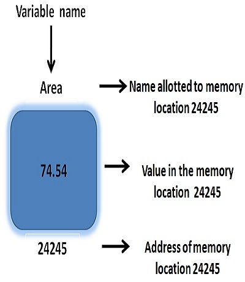

## Con Trỏ ( Pointer )

- Với những ai từng học lập trình đặc biệt là C,C++ chắc chắn khi nghe đến cụm từ này cảm giác sợ hãi từ quá khứ ùa về trong bạn phải không nhỉ ( Còn nếu không thì bạn thật sự là một lập trình viên mà mọi cong ty đều mong mỏi muốn tuyển đó ). Đùa thôi! Thực tế  thì trong C/C++, con trỏ là một khái niệm khá là khó, nhất là đối với những ai mới đầu làm quen với nó. Nhưng đừng lo lắng vì con trỏ trong Go không phức tạp như trong C/C++ đâu,bạn sẽ dẽ dàng quen với nó ngay sau khi hoàn thành chương này thôi, cứ tin tôi đi.

- Con trỏ chỉ là một biến nhưng biến này sẽ được sư dụng để  lưa trữ địa chỉ ( address ) của một biến khác.
Nghe có vẻ hơi khó hiểu nhưng đừng hấp tấp, từ từ tôi sẽ giải thích. Trước tiên bạn phải hiểu địa chỉ là gì cái đã. Khi bạn khai báo một biến, ngay lập nó sẽ được cấp phát bộ nhớ cho việc lưu trữ dữ liệu, mỗi dữ liệu này sẽ được đặt trong một địa chỉ xác định. Vd như sơ đồ  sau:

<br>
<p align="center">
  
</p>
<br>

- Như hình vẽ, ở đây bạn có một biến với tên gọi là `Area` thuộc kiểu số  thực với giá trị là `74.54` và một dịa chỉ được liên kết với nó là `24245`, trong một số  hình khác bạn có thể  thây địa chỉ được viết dưới các dạng như 0x000001, 0x24245 , cơ bản không có gì , bản chất nó vẫn là số  nguyên thôi nhưng được biẻu diễn dưới dạng có thể  là nhị phân, thập phận hay thập lục phân. Tuy nhiên hãy để  ý là ở hình vẽ thì thông tin địa chỉ chúng được chú thích và lặp lại khá nhiều, lí giải điều này là bởi vì bản chất của một biến được tạo ra thực chất là tạo ra một địa chỉ vùng nhớ cho việc lưu trữ dữ liệu, tuy nhiên không phải ai cũng có trí nhớ siêu phàm dể  có thể nhớ được hết các con số  trong địa chỉ vùng nhớ cả do đó tên biến dược tạo ra và liên kết với địa chỉ vùng nhớ giúp cho bạn truy cập vào vùng nhớ này một cách dễ  dàng hơn.

- Vậy thế  còn con trỏ là gì ? và tại sao nó lại lưu trữ địa chỉ vùng nhớ ? Ah hãy nhìn hình vẽ sau:

<br>
<p align="center">
  
</p>
<br>

- Ở đây chúng ta có một biến `a` thuộc kiểu dữ liệu số  nguyên với địa chỉ là 0x0001, trong địa chỉ này lưu trữ một giá trị là 10. Tiếp đó phía dưới ta có một con trỏ `p` thuộc kiểu số  nguyên trỏ tới địa chỉ của a ( ở đây dịa chỉ một một biến sẽ sử  dụng ký tự `&` đặt trước ). Ta nói `p` trỏ tới `a` thực chất là `p` sẽ lưu trữ địa chỉ của `a` và dựa vào địa chỉ đó để  gọi tới `a` ( chính xác là địa chỉ ) bất cứ lúc nào cũng đc. Ngoài ra `p` cũng có địa chỉ của riêng nó.

- Thực tế  khái niệm của con trỏ không có gì là phức tạp cả, phần lớn cá lập trình viên gặp khó khăn khi thao tác với con trò do đó chúng ta sẽ làm qua một vài ví dụ để  hiểu rõ cách hoạt động và thao tác với con trỏ như thế  nào.

- Trước khi đi vào ví dụ, chúng ta sẽ làm quen với cách khai báo, khởi tạo một con trỏ trước đã. Trong Go con trỏ sẽ được khai báo với cú pháp sau:

```go
var p_name * Type
``` 

- Trong đó:
  + `p_name`: là tên của con trỏ mà bạn muốn khai báo.
  + `*`: ký tự này cho biết rằng đây là một con trỏ.
  + `Type`: kiểu dữ liệu mà con trỏ trỏ tới.

- Lưu ý: Con trỏ cũng yêu cầu kiểu dữ liệu xác định, nếu bạn sử  dụng một con trỏ kiểu chuỗi trỏ tới một biến thuộc kiểu số  học thì ngay lập tức Go sẽ thông báo lỗi.

- Để  ý con trỏ cũng có thể  coi là một loại biến, vì thế  nó cũng có giá trị mặc định khi khởi tạo. Tuy nhiên khác với biến sẽ được khởi tạo cùng với giá trị mặc định thuộc kiểu dữ liệu đó. Trong con trỏ bất kể  là kiểu dữ liệu nào thì nó vãn luôn được khởi tạo cùng với giá trị `nil`.

```go
package main
import "fmt"

func main() {
  var a int = 10
  var p *int 

  fmt.Println("Giá trị của biến a là:", a)
  fmt.Println("Địa chỉ của biến a là:", &a)
  fmt.Println("Giá trị của con trỏ p là:", p)
  fmt.Println("Địa chỉ của con trỏ p là:", &p)

  p = &a
  fmt.Println("")
  
  fmt.Println("Giá trị của con trỏ p sau khi gán là:", p)
  fmt.Println("Giá trị của biến được trỏ là:", *p)

  *p = 20

  fmt.Println("Giá trị của biến a sau khi thay dổi con trỏ là:", a)
}
```

- Kết quả 

```go
Giá trị của biến a là: 10
Địa chỉ của biến a là: 0xc420012178
Giá trị của con trỏ p là: <nil>
Địa chỉ của con trỏ p là: 0xc42000c028

Giá trị của con trỏ p sau khi gán là: 0xc420012178
Giá trị của biến được trỏ là: 10
Giá trị của biến a là: 20
```

- Trong ví dụ này chúng ta không làm gì mới cả mà chỉ dựa trên sơ đô trên thôi. Đầu tiên chúng ta sẽ khai báo và khởi tạo biến a 
thuộc kiểu số nguyên và giá trị là 10 sau đó chúng ta khai báo một con trỏ p cũng thuộc kiểu số  nguyên. Tiếp đó ta sẽ in ra màn hình. Như chúng ta thấy con trỏ khi dược khởi tạo giá trị mặc định của nó là nil. Tiếp tục, ta sẽ trỏ con trỏ p tới biến a, nhưng có một điều cần chú ý đó là mặc dù con trỏ p và biến a có cùng kiểu dư liệu nhưng chúng hoàn toàn khác nhau do đó bạn không thế  gán con trỏ p tói biến a bằng cách bình thường được mà phải sử  dụng địa chỉ vùng nhớ của biến a để  lưu trữ trong con trỏ p. Một chú ý nữa là su khi đã trỏ tơi biến a, con tại vùng nhớ của trỏ sẽ lưu trữ địa chỉ của biến a ( hãy nhìn vào kết quả in ra bạn sẽ thấy ), tuy nhiên bạn hoàn toàn có thể  truy cập vào giá trị của biến a bằng cách sử  dụng toán tử  trỏ đến `*` ( dereferencing ) đặt trước con trỏ. Và bởi vì con trỏ p trỏ tới a hay tham chiếu tới a cho lên bất cứ khi nào bạn thay đổi thông tin giá trong a hoặc từ p thì cả hai cũng đồng thòi thay đổi.

- Lưu ý: là một con trỏ không chỉ có chức năng trỏ tới một địa chỉ của một biến mà còn có thể  trỏ tới các con trỏ khác, hãy nhớ rằng con trỏ cũng có địa chỉ lưu trữ. Khi đó ta có thể  coi con trỏ này như một con trỏ cấp hai, và bạn có thể  có n cấp con trỏ tùy thuộc vào cách bạn sử  dụng:

Vd:

```go
package main
import "fmt"

func main() {
  var a int = 10
  var p *int = &a
  var pp **int = &p
  
  fmt.Println("Giá trị của con trỏ p sau khi gán là:", p)
  fmt.Println("Giá trị của biến được trỏ là:", *p)

  fmt.Println("Giá trị của con trỏ pp sau khi gán là:", pp)
  fmt.Println("Giá trị của cấp 1 là:", *pp)
  fmt.Println("Giá trị của cáp 2 là:", **pp)
}
```

- Kết quả:

```go
Giá trị của con trỏ p sau khi gán là: 0xc420012178
Giá trị của biến được trỏ là: 10
Giá trị của con trỏ pp sau khi gán là: 0xc42000c028
Giá trị của cấp 1 là: 0xc420012178
Giá trị của cáp 2 là: 10
```

### Kiểu Tham chiếu

- Chúng ta đã tìm hiểu về  hàm và cũng biết được rằng các tham số  truyền vào luôn cơ bản là kiểu dữ liệu giá trị ( tức là một dữ liệu copy của bản gốc ). Nhưng với sự trợ giúp của con trỏ bạn hoàn toàn có thể  sử  dụng các tham số  truyền vào như như một kiểu dữ liệu tham số  được. Hãy xét vd sau :

```go
package main
import "fmt"

func ChangeValue(p *int, value int) {
  *p = value
}

func appendString(s* string, word string) {
  *s += word
}

func main() {
  var a int = 10
  var s string = "Hello "

  fmt.Println("Giá trị của a là:", a)
  fmt.Println("Giá trị của chuỗi s là:", s)

  ChangeValue(&a, 20)
  appendString(&s, "Go!")

  fmt.Println("Giá trị của a là:", a)
  fmt.Println("Giá trị của chuỗi s là:", s)
}
```
- Hãy chạy chương trình , bạn sẽ nhận được kết quả sau:

```go
Giá trị của a là: 10
Giá trị của chuỗi s là: Hello
Giá trị của a là: 20
Giá trị của chuỗi s là: Hello Go!
```

- Bằng việc sử  dụng tham số  là một con trỏ và truyền vào tham số  con trỏ đó địa chỉ của biến tương ứng với kiểu dữ liệu, sau đó bất kỳ các đoạn logic, thực hiện nào tác động với con trỏ tham số  này cũng sẽ ảnh hưởng tới biến truyền vào.


### Tổng kết

Trong chương này chúng ra đã tìm hiểu vể  con trỏ và thực hiện một số  thao tác với con trỏ rồi, và như bạn thấy, con trỏ trong Go thực sự rất đơn giản phải không, không có bất kỳ một chỗ  nào gọi là phức tạp khó hiểu cả.    


